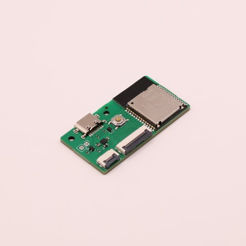
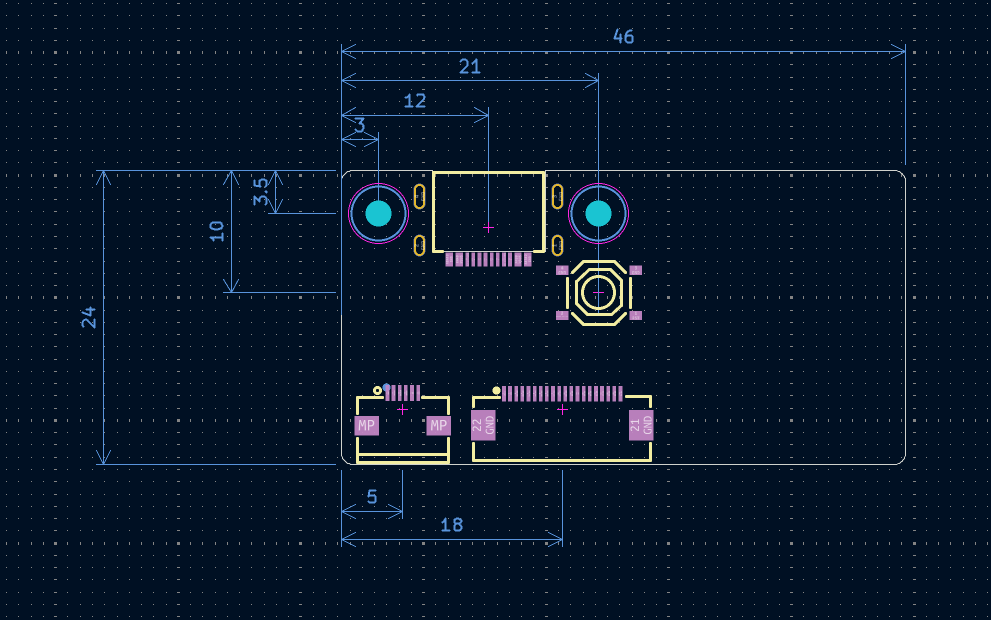

# usu-aoba

usu-aobaはnRF52840を搭載した、乾電池駆動対応の薄型マイコンボードです。

キーボード基板とはFPCケーブルで接続でき、18本のGPIOを利用可能です。さらに、トラックパッドやトラックボールなどの拡張モジュールを接続するための6ピンFPCコネクタも搭載しています。

省スペースな構成で、薄型ワイヤレスキーボードの製作に適しています。

## 寸法

## ピン配置

0.5mmピッチの20p FFCコネクタと6p FFCコネクタを搭載しています。

### 20pコネクタ

| 番号 | ラベル         | 接続  |
| ---- | -------------- | ----- |
| 1    | +BAT(1.0~3.3V) |       |
| 2    | GND            |       |
| 3    | GPIO18         | P1.13 |
| 4    | GPIO17         | P1.15 |
| 5    | GPIO16         | P0.02 |
| 6    | GPIO15         | P0.29 |
| 7    | GPIO14         | P0.31 |
| 8    | GPIO13         | P0.26 |
| 9    | GPIO12         | P0.06 |
| 10   | GPIO11         | P0.08 |
| 11   | GPIO10         | P1.09 |
| 12   | GPIO9          | P0.12 |
| 13   | GPIO8          | P0.13 |
| 14   | GPIO7          | P0.15 |
| 15   | GPIO6          | P0.20 |
| 16   | GPIO5          | P0.22 |
| 17   | GPIO4          | P0.24 |
| 18   | GPIO3          | P1.00 |
| 19   | GPIO2          | P0.09 |
| 20   | GPIO1          | P0.10 |

### 6pコネクタ

6pコネクタ用のピンは20pコネクタのGPIO7~10と共用です。

| 番号 | ラベル    | 接続  |
| ---- | --------- | ----- |
| 1    | GND       |       |
| 2    | GPIO9     | P0.12 |
| 3    | GPIO10    | P1.09 |
| 4    | GPIO7     | P0.15 |
| 5    | GPIO8     | P0.13 |
| 6    | VCC(3.3V) |       |

## ブートローダ起動方法

リセットスイッチを素早く2回押してください

## ファームウェア

[ZMK用コンポーネント](https://github.com/sekigon-gonnoc/zmk-component-usu-aoba)